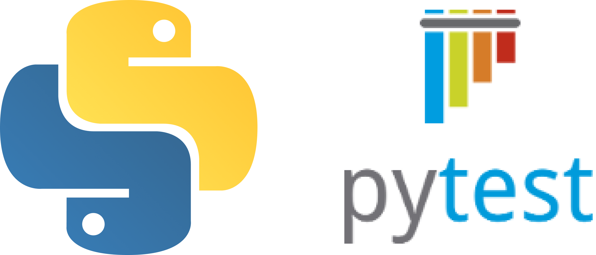

# pytest

[](https://github.com/TiagoMPereira/pytest_C214/actions/workflows/CI_tests.yml)

Repositório contendo a aplicação referente ao seminário de Engenharia de Software (2º semestre - 2022).

O pytest é uma ferramenta utilizada para criar e executar testes em python. Sua instalação, aplicação e execução são simples e serão descritas em passos posteriores.

<div align='center'>
</img>
</div>

---
## Clonando projeto
O primeiro passo para executar o projeto é cloná-lo na sua máquina. Para isso, abra o terminal de comando, navegue até o diretório onde deseja alocar o projeto e entre com o seguinte comando:  
```git clone https://github.com/TiagoMPereira/pytest_C214.git```  
Em seguida entre no diretório clonado  
```cd pytest_C214```  

---
## Gerência de dependências
No python a gerência de dependências é feita criando um ambiente virtual e especificando quais pacotes (e quais suas versões) serão utilizados no projeto. Para criar um ambiente virtual basta digitar o seguinte comando no terminal:  
```python -m venv env_projeto```  
Uma vez criado, é preciso ativar o ambiente virtual:  
```env_projeto\Scripts\activate.bat``` (Windows cmd)  
```env_projeto\Scripts\Activate.ps1``` (Windows powershell)  
```env_projeto/bin/activate``` (Linux/MacOS)  

Com o ambiente ativado basta importar as dependências:  
```pip install -r requirements.txt```  
Da mesma forma, é possível gerar o arquivo de dependências com todos os pacotes e versões utilizadas digitando:  
```pip freeze > requirements.txt```  

---
## Instalação
Caso o pytest não esteja nos requisitos instalados pelo requirements.txt é possível instalá-lo a parte.  

```pip install pytest```  


---
## Uso

Para utilizar o pytest basta criar um novo projeto python, qualquer IDE pode ser utilizada para tal.  
O pytest, ao ser executado, varre todo o projeto em busca de arquivos nomeados com test_*.py ou *_test.py. Portanto basta alocar os testes em arquivos que sigam tal nomeclatura que serão automaticamente executados.  
A estrutura utilizada no projeto será:  
|---*src/*  
|------*xxxx/*  
|---------*\_\_init\_\_.py*  
|---------*file1.py*  
|---------*file2.py*  
|---*tests/*  
|------*\_\_init\_\_.py*  
|------*func1/*  
|---------*\_\_init\_\_.py*  
|---------*test1.py*   
|------*func2/*  
|---------*\_\_init\_\_.py*  
|---------*test2.py*  
|---------*test3.py*  

Uma vez que os testes foram criados, basta executar o comando  
```pytest```  
e toda a suíte de testes será executada.

--- 
## Descrição do projeto
O projeto consiste na simulação de um elevador.

Foram implementadas as seguintes funcionalidades:

Para o elevador:
- Mover um andar -> Move um andar do elevador, baseado na posição atual.
- Mover -> É fornecido o andar desejado e executa a função de mover um andar até o destino.

Para o usuário:
- Chamar elevador -> Executa o mover do elevador até o andar que o usuário se encontra.

---
## Casos de teste
descrever os casos de teste

---
## CI
Foi adicionada ao repositório uma ação automática para executar toda a suíte de testes sempre que um push for dado em qualquer uma das branches.